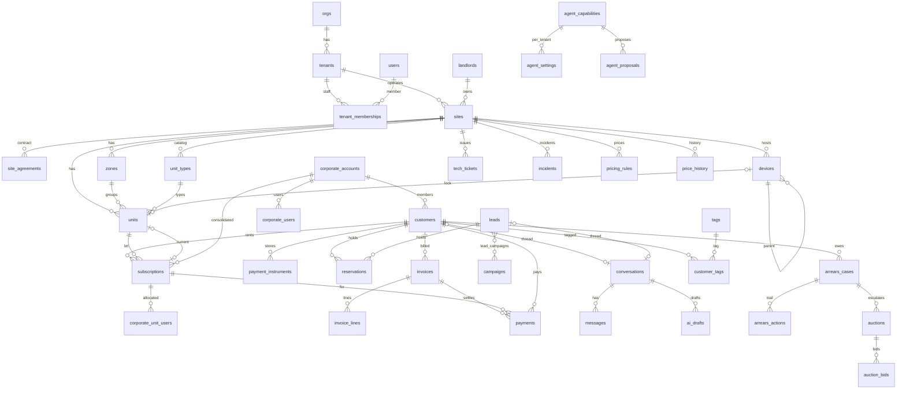

# Data model

Three schemas, one database. The **core** (`public`) is the future system and is derived from the operator-console UX memo. The **legacy** schema is the existing Zoho data, unchanged in meaning. `zoho_raw` is verbatim staging.

Authoritative DDL: `db/migrations/0001…0005`. This document explains the shape and the rules; when they disagree, the SQL wins.

---

## 1. Conventions

| Rule | Detail |
|---|---|
| Keys | `uuid` primary keys. Backend UUIDs from the Flexistore app are reused where they exist (sites, units, customers, subscriptions); everything else is `gen_random_uuid()` or a deterministic `import.stable_uuid(namespace, key)` so re-imports produce the same ids. |
| Tenancy | `tenant_id` on every operational row. RLS policy `tenant_isolation` on every such table in `public` and `legacy`. Views are `security_invoker`. |
| Tenant-scoped references | Parents carry `unique (tenant_id, id)`; children reference `(tenant_id, parent_id)`. A row cannot point at another tenant's parent. Partitioned tables (`activity_log`, `messages`) enforce the same with `enforce_tenant_refs()`. |
| Money | `bigint` minor units (cents/øre) + `currency char(3)` on the same row. Never a bare decimal, never an implicit currency. |
| Time | `timestamptz` (UTC). `date` only where the memo says date (billing days, start/end dates). |
| Provenance | `source` + `source_ref` on every table that can be fed from outside (`'zoho'` + `zcrm_…`, `'paystack'` + reference, …). Unique per tenant → imports and syncs are idempotent upserts. |
| Soft delete | `deleted_at` on customers, units, sites, subscriptions, leads, notes, devices, landlords, corporate accounts. |
| Audit | Every staff mutation → `audit_log` (before/after JSONB). Every state change → `activity_log`. |
| Counters | `next_number(tenant_id, key)` for human ids (`C-24551`, `INV-202605-0142`, `L-2031`, `T-1024`). |
| Vocabulary | Postgres enums for closed vocabularies the UI switches on (`unit_status`, `subscription_status`, `payment_status`, `lead_stage`, `device_kind`, `device_status`, `channel_kind`, `author_kind`, `customer_kind`, `kyc_status`, `site_status`, `staff_role`). Free-text `text` + `check` for vocabularies likely to grow per tenant. |

---

## 2. Core model (`public`)

### 2.1 Entity map

Cross-cutting, polymorphic by `(target_kind, target_id)`: `notes`, `documents`, `activity_log`. `saved_reports`, `audit_log`, `tenant_counters` are per tenant without a parent.

### 2.2 Tables by memo section

| Memo section | Tables | Notes |
|---|---|---|
| Conventions | `tenants`, `users`, `tenant_memberships`, `audit_log`, `tenant_counters` | Roles: super_admin, admin, manager, operator, viewer |
| §1 Ops cockpit | `v_cockpit_kpis`, `v_site_occupancy`, `v_schedule`, `incidents`, `agent_proposals`, `activity_log` | The cockpit is views over other modules; nothing is stored twice |
| §2 Inbox | `conversations`, `messages` (partitioned), `ai_drafts` | One conversation per customer or lead; channels as an array on the conversation; author_kind ∈ customer, agent_ai, operator, system |
| §3 Customers | `customers`, `customer_tags`, `tags`, `payment_instruments`, `subscriptions`, `documents`, `notes` | `flags` jsonb for arrears/suspended/vip_priority; `kyc_*` columns; `account_number` per tenant |
| §4 Corporate | `corporate_accounts`, `corporate_users`, `corporate_unit_users`; `subscriptions.internal_label`, `.cost_code` | A corporate "unit" is a subscription with a corporate account; users are allocated per subscription |
| §5 Leads | `leads`, `campaigns`, `lead_campaigns`, `reservations` | `loss_reason_code` is the memo's training signal; `attribution` jsonb holds UTM/gclid; `reservations` is the 30-minute hold with a payment link |
| §6 AI activity | `agent_capabilities` (global catalogue), `agent_settings` (per tenant: mode + threshold), `agent_proposals` | Proposals resolve to `approved / rejected / adjusted / expired` with the resolver and a resolution payload |
| §7 Devices | `devices` (tree: udm → switch/gateway → hub → lock/sensor/light, `parent_id`), `incidents` | One table, `kind` + `attrs` jsonb; locks link to `units`; `site_id` null = spare stock |
| §8 Facilities | `sites`, `zones`, `unit_types`, `units`, `landlords`, `site_agreements`, `tech_tickets` | Unit has `tier` (normal/climate/vip) and both `normal_price_minor` / `vip_price_minor`; wiring columns `hub_id/hub_port/gateway_id/gateway_poe_port`; `meters_from_entrance` |
| §9 Subs & invoices | `invoices`, `invoice_lines`, `payments`, `pricing_rules`, `price_history` | `invoice_lines.product_kind` and `revenue_share_eligible` support Phase 6 payouts |
| §10 Arrears | `arrears_cases`, `arrears_actions`, `auctions`, `auction_bids` | Stages and statuses exactly as the memo |
| §11 Reports | `saved_reports` + views | Report numbers are queries; nothing precomputed in Phase 1 |
| Cross-cutting | `notes`, `activity_log`, `documents` | `activity_log.action` uses the memo's dotted vocabulary (`payment.settled`, `lock.unlock`, …) |

### 2.3 Status vocabularies

| Enum | Values | Source |
|---|---|---|
| `unit_status` | available, occupied, reserved, maintenance, decommissioned | memo §8 |
| `subscription_status` | pending, active, arrears, notice_given, paused, suspended, closed | memo §3 + planning reference |
| `payment_status` | settled, pending, failed, reversed, refunded, authorised | memo §9 |
| `invoice_status` | draft, pending, paid, partially_paid, overdue, retry, written_off, cancelled | memo §9 |
| `lead_stage` | new, contacted, qualified, visiting, reserved, converted, lost | memo §5 |
| `device_status` | good, watch, bad, unknown | memo §7 |
| `kyc_status` | unknown, pending, verified, declined | memo §3 |
| `channel_kind` | whatsapp, email, chat, sms, phone | memo §2 |

### 2.4 Views (all `security_invoker`)

| View | Purpose |
|---|---|
| `v_site_occupancy` | Units by status, occupancy %, MRR per site — the cockpit heat strip and Facilities list |
| `v_cockpit_kpis` | MRR, outstanding, collected today, move-ins/outs, device counts, pending proposals per tenant |
| `v_schedule` | Move-ins, move-outs, tours from subscriptions and leads |
| `v_arrears` | Subscriptions in arrears joined to their open case |

### 2.5 Partitioning

`activity_log` and `messages` are range-partitioned by month (2020-01 → 2027-12 + default). Add a yearly job that creates the next 12 partitions. Indexes lead with `tenant_id` or with the entity key + time so per-customer and per-unit timelines are index scans.

---

## 3. Legacy model (`legacy`)

Thirty tables, one per Zoho module that carries data, typed exactly as the backup analysis describes (`docs/source/ZOHO_BACKUP_CRM_IMPORT_SPEC_2.md`). Rules:

* `zoho_id` is the primary key; backend UUIDs are kept as `*_uuid` columns with unique partial indexes.
* Every row has `tenant_id`, `market` (SA/NO/FI) and `market_source` (`country`, `currency`, `financial_tool`, `reservation`, `facility`, `organisation`, `owner_role`, `line`, `module`, `default`).
* Picklists are verbatim text. Timestamps converted from SAST. Money stays `numeric` here (converted to minor units only in core).
* `extra jsonb` holds every source column, so a mapping gap is recoverable without re-staging.
* `app_events` is partitioned by month (2.09M rows).
* Modules the analysis marks as junk or superseded (Accounts, Event History, StickyNotes, Facilities_RecordAccess, Contact Product Relation, Lead Status history, Franchise Agreement History) are **staged only** (`zoho_raw`), never typed.

---

## 4. Legacy → core mapping

| Legacy | Core | Rule |
|---|---|---|
| `facilities` | `sites` (+ one `zones` row "A", `site_agreements`, `landlords` via prospect → business partner) | id = FacilityID uuid; `short_code` from Department Code letters (unique per tenant); counters → `physical_spec`, flagged stale |
| `units` | `units`, `unit_types` (distinct size label per site), `devices` (gateway → board → lock) | id = storageUnitId; number = last segment of `easyId`; status map in §4.1; tier = normal |
| `contacts` (population ≠ web_visitor) | `customers` | id = AppUser UUID; account numbers per tenant in creation order; KYC map; language map; SalesIQ stubs stay legacy-only |
| reservations with `User ID` not in contacts | `customers` placeholder (`source='zoho-orphan'`, status closed) | keeps subscription history of deleted app accounts |
| `reservations` payment status ∉ {UNPAID, PENDING} | `subscriptions` | id = Reservationid; price = discounted price; `billing_day` = day of start date; status map in §4.2; Zoho-only fields → `legacy` jsonb |
| `reservations` payment status ∈ {UNPAID, PENDING} | `reservations` | abandoned / pending holds; Phase 5 abandoned-cart recovery reads these |
| `payment_details` | `payment_instruments` | one per customer × provider × token; linked from the subscription |
| `payments` (not test) | `payments` | method/provider/status maps in §4.3; failed attempts keep the attempted amount; provider payload → `raw` |
| `gateways` | `devices` kind gateway | spare stock → `site_id` null |
| `leads`, `old contacts` | `leads` | stage: created within 30 days of the newest lead → new, else lost with `loss_reason_code='stale_import'`; matched customer by email |
| `campaigns`, `campaign_lead_members` | `campaigns`, `lead_campaigns` | |
| `emails`, `smses`, `calls`, SalesIQ `notes` | `conversations` + `messages` | one conversation per customer; direction/author by type |
| other `notes` | `notes` on customer | |
| `communications`, `app_events`, `unit_status_history`, `reservation_status_history` | `activity_log` | action map in §4.4; unit-history timestamps reconstructed and flagged |
| `app_events` SYSTEM_NOTIFY "Price for unit type …" | `price_history` (kind dynamic) | regex on heading |
| `attachments` on facilities/contacts | `documents` | `local_path` until re-hosted |
| `business_partners` type Property Owner | `landlords` | |
| `property_prospects`, `offer_requests`, `tasks`, other partners, web visitors, metadata | **legacy only** | shown in the console's Legacy (Zoho) tab; no core home in the memo |

### 4.1 Unit status

| Zoho | Core |
|---|---|
| AVAILABLE, CHECKED_OUT | available |
| RESERVED_PENDING, RESERVED_UNPAID | reserved |
| RESERVED_PAID, RESERVED_PAYMENT_PROBLEM, RESERVED_CANCELLING, RESERVED_PROBLEM_CANCELLING, CANCEL_NEXT_PERIOD, RESERVED_CANCEL_NEXT_PERIOD | occupied |
| NOT_AVAILABLE (active, no decommission date) / PROBLEM | maintenance |
| NOT_AVAILABLE (inactive or decommissioned) | decommissioned |

The Zoho value is kept in `units.status_detail`.

### 4.2 Subscription status

| Zoho Payment Status (Order Status) | Core |
|---|---|
| PAID | active |
| PROBLEM, PROBLEM_CANCELLING | arrears |
| CANCELLING, CANCEL_NEXT_PERIOD | notice_given |
| MAINTENANCE | paused |
| (Suspended) | suspended |
| CHECKED_OUT, DEMO | closed (`closed_reason` checked_out / demo) |

### 4.3 Payments

| Zoho provider × display | Core method | Core provider |
|---|---|---|
| Stripe | stripe-card | stripe |
| Paystack (EFT display) | paystack-eft | paystack |
| Paystack | paystack-card | paystack |
| POG | invoice | poweroffice |
| Xero (EFT display) | manual-eft | xero |
| Xero | invoice | xero |
| any, CREDIT_NOTE display | credit_note | as above |

Status: succeeded/approved/captured/paid → settled; refunded → refunded; requires_capture → authorised; requires_action/requires_confirmation/processing/pending → pending; everything else (declined, requires_payment_method, cancelled, failed) → failed.

### 4.4 Activity actions

| Zoho EventType | `activity_log.action` |
|---|---|
| UNLOCK, WATCHLIST_UNLOCK | lock.unlock |
| WATCHLIST_ADD | customer.watchlisted |
| DOOR_ALARM_BREACH / DOOR_ALARM_OK | lock.alarm / lock.alarm_cleared |
| RECURRING_PAYMENT (success / failure) | payment.settled / payment.failed |
| PAYMENT_SUCCESS / PAYMENT_PROBLEM / OUTSTANDING_PAYMENT | payment.settled / payment.failed / invoice.overdue |
| PAYMENT_DETAILS_CHANGED / REFUND PAYMENT / CUSTOMER_INVOICE_REQUEST | customer.payment_method_changed / payment.refunded / invoice.requested |
| RESERVE / NEW_RESERVATION_PAID / CANCEL / CHECKOUT / DELETE / REACTIVATE / SUSPEND / UNSUSPEND / ITEM_MANAGE | subscription.reserved / started / notice_given / cancelled / deleted / reactivated / suspended / unsuspended / items_changed |
| SHARE_INVITE / SHARE_ACCEPT(ED) / SHARE_REJECTED / SHARE_REVOKED | customer.key_share_invited / accepted / rejected / revoked |
| FACILITY_NOT_REPORTING | device.status_changed (severity bad) |
| SYSTEM_NOTIFY (price) / SYSTEM_NOTIFY (other) | pricing.changed / system.notify |
| SUPPORT / TASK / MANUAL_VERIFICATION / DELETE_ACCOUNT | ticket.created / task.created / customer.kyc_manual / customer.deleted |
| Communications rows | notification.<event> |
| Unit / reservation status history | unit.status_changed / subscription.status_changed |

The raw event type, success flag, parsed `Details` and the raw details text are kept in `payload`.

---

## 5. Multi-tenant safety checklist

Verified by `db/apply.sh` + `tools/zoho-import/tests/test_e2e.py`:

- [x] RLS enabled and forced on every tenant-bearing table in `public` and `legacy` (132 policies), plus derived policies on join tables without `tenant_id`.
- [x] Views are `security_invoker`; a tenant sees only its rows through `v_site_occupancy`.
- [x] Composite `(tenant_id, id)` foreign keys on all core relationships (60 constraints); a cross-tenant insert fails with `23503`.
- [x] `app` role has no `BYPASSRLS`; `app_import` does and is used only by the importer.
- [x] `app_tenant_ids()` is `stable parallel safe`, so policies reduce to an index-friendly `= any(array)`.
- [x] Per-tenant counters, per-tenant unique account numbers/emails/short codes.
- [ ] Per-tenant encryption keys for secrets (application layer, Phase 1 M3).
- [ ] Tenant export / erasure jobs (Phase 6; export of a single customer in Phase 1).
