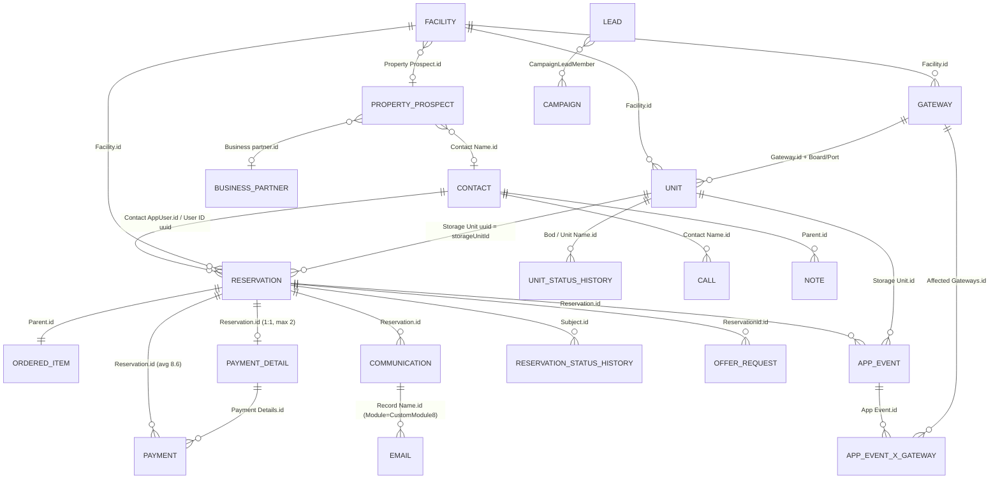

# Zoho CRM Backup (Data_001) — Base CRM Import Specification for Claude Code

Prepared 2026-09-05 from `zoho backup/Data_001 (1)/` (Data + Metadata + RecordImages) and `zoho backup/Attachments/`.
Every number below was computed from the CSVs themselves; nothing is assumed from the Zoho UI.

---

## 0. Read this first — what the backup actually is

**This is the whole Flexistore group's Zoho org, not an SA-only export.** Org ID 783117774, backup taken by `geir@flexistore.no`, org time zone `Africa/Johannesburg`. It contains Norway (42 facilities), South Africa (11) and Finland (2) in the same tables. Roles confirm the shared tenant: `Manager Norway`, `Manager South Africa`, `Manager Finland`, `Support Agent Norway South Africa`.

Consequences for the base CRM:

1. The schema must carry a `market` column (`NO` / `SA` / `FI`) on every operational table. Do **not** build an SA-only schema and hope to filter later.
2. `Organisation` (values `FX-NO`, `FX-SA`, `FX-ZA`, `FX-FI`, `FX-FIN`, `Flexistore`) is **unreliable before 2025**. Until ~Jan 2025 the backend wrote `Flexistore` (= untagged) on everything: 12,694 of 27,214 reservations and 75,989 of 187,664 payments carry it. Derive market from `Facility.Country` (100% filled, 55 rows) or `Currency Code` (`NOK`/`ZAR`/`EUR`), never from `Organisation`. `FX-ZA` and `FX-FIN` are legacy spellings of `FX-SA` and `FX-FI`.
3. **Timestamps in the CSVs are SAST (UTC+2, no DST).** Verified: `SMSes.Created Time` minus `SMSes.Submitted` (UTC from BulkSMS) is exactly +2h00 in every month April 2024 → Oct 2025, including European summer and winter. So the Zoho export uses the org time zone, not the backup user's Europe/Berlin. JSON timestamps inside `AppEvents.Details` (`"created":"2026-07-06T07:44:45.235"`) are backend UTC. Convert both to UTC on import.
4. **Three ID systems coexist.** (a) Zoho record ids `zcrm_5361160000…` (the `Record Id` / `*.id` columns); (b) backend UUIDs (`AppUser UUID`, `Reservationid`, `storageUnitId`, `FacilityID`, `appeventId`); (c) human codes (`easyId` = `FX-NO-0001-0001`, `Department Code` = `RBM01`, `Order Number` = `00000009`, `Reservation Order Number` = 10-char `rcmkNXFhkY`). The backend UUID is the canonical key — Zoho is a mirror of the Flexistore backend (nearly every operational record is owned by `integration@flexistore.no` or `johanv@flexistore.no`). Keep the Zoho id as a secondary column for traceability only.
5. Zoho splits exports at 100,000 rows: `AppEvents_C_001…021`, `Payments_C_001…002`, `Status History_C_001…004`. Concatenate before loading. Row counts by `grep -c '^zcrm_'` are exact because every record starts a new line with its id.
6. `Attachments_001.csv` (399 rows) is an index; the binaries (≈680 files, 1.1 GB) are in `zoho backup/Attachments/` named `<fileid>_<original name>`. 266 of 399 hang off Facilities (PriceBooks), 88 off Property Prospects. `RecordImages/` holds 2 PNGs (gateway image, org logo).

---

## 1. Entity map — how the modules relate

Zoho's standard modules were relabelled: `PriceBooks` → **Facilities**, `Products` → **Bods / Units**, `SalesOrders` → **Reservations**, `Ordered Items` = reservation line items. Everything else that matters is a custom module (`CustomModule1` = Payments, `2` = Payment Details, `3` = Property Prospects, `5` = AppUsers (legacy), `6` = AppEvents, `8` = Communications, `9` = OfferRequests, `10` = Gateways, `11` = Properties (legacy), `12` = Business Partners, `23` = SMSes).

Join-key validation (non-null FK values that resolve to a parent row):

| Child → Parent | Non-null | Resolves |
|---|---|---|
| Reservations.`Contact AppUser.id` → Contacts | 26,691 | 99.9% |
| Reservations.`User ID` (uuid) → Contacts.`AppUser UUID` | 27,214 | 97.6% |
| Reservations.`Facility.id` → Facilities | 27,214 | 100% |
| Reservations.`Storage Unit` (uuid) → Bods.`storageUnitId` | 27,214 | 100% |
| Ordered Items.`Parent.id` → Reservations | 27,229 | 100% |
| Payments.`Reservation.id` → Reservations | 187,575 | 100% |
| Payments.`Payment Details.id` → Payment Details | 187,284 | 100% |
| Payment Details.`Reservation.id` → Reservations | 27,097 | 100% |
| Communications.`Reservation.id` / `Contact.id` | 79,138 / 78,519 | 100% / 99.9% |
| Bods.`Facility.id` / `Gateway.id` | 7,071 / 5,119 | 100% / 100% |
| Bods.`reservationId` (uuid) → Reservations.`Reservationid` | 5,932 | 100% |
| Facilities.`Property Prospect.id` → Property Prospects | 45 | 100% |
| Property Prospects.`Business partner.id` / `Contact Name.id` | 129 / 125 | 100% / 100% |
| Status History.`Bod / Unit Name.id` → Bods | 305,287 | 100% |
| Status History Gads.`Subject.id` → Reservations | 14,617 | 100% |
| AppEvents.`Reservation.id` / `Contact AppUser.id` / `Storage Unit.id` (last chunk) | 75k each | 100% |

The data is referentially clean. The 2.4% of reservations whose `User ID` does not match a contact UUID are deleted app accounts (`DELETE_ACCOUNT` events exist); keep them as orphan customers with `deleted=true`.

### 1.1 The rental spine (what a self-storage CRM is actually about)

**Facility → Unit → Reservation → Payment Detail → Payments**, with **Contact** as the customer.

- A **Facility** is a site. Fields carry the physical spec (NLA m², GFA m², units, lift, access height, mezzanine, camera/network system, trolleys, pallet jacks), the commercial deal (`Agreement Type` Revenue Share / Fixed rent / Other; `Franchise Agreement` PPU for Finland; `Monthly Franchise fee`), the accounting link (`Department Code` = Xero/PowerOffice tracking code, `Finance Tool Code`), and **status counters** (`RESERVED_PAID`, `AVAILABLE`, `NOT_AVAILABLE`, `RESERVED_PAYMENT_PROBLEM`, `RESERVED_CANCELLING`, `RESERVED_PENDING`, `CHECKED_OUT`, `Current Occupancy (Percentage)`). Those counters were **last refreshed 2025-12-10** on 44 of 55 rows — the counter sync is dead. Do not import them as live occupancy; compute occupancy from Units.Status (which is live — modified through 2026-09-01) exactly as the existing FXSA occupancy formula does.
- A **Unit** (Bod) is one lettable box. `easyId` = `FX-<MKT>-<facility#>-<unit#>` is the human key; `storageUnitId` is the backend UUID. `Size` is in m³ for Norway ("5 kubikk") and effectively m² labelling in SA — the `Width/Height/Depth (m)` and `Size (m2/m3) - Calculated` fields are only 35–62% filled. `Status` is the live state machine (picklist: `AVAILABLE`, `RESERVED_PENDING`, `RESERVED_UNPAID`, `RESERVED_PAID`, `RESERVED_PAYMENT_PROBLEM`, `RESERVED_CANCELLING`, `RESERVED_PROBLEM_CANCELLING`, `CANCEL_NEXT_PERIOD`, `RESERVED_CANCEL_NEXT_PERIOD`, `CHECKED_OUT`, `NOT_AVAILABLE`, `PROBLEM`). `reservationId` on the unit = the reservation currently occupying it. Lock wiring: `Gateway.id` + `Board Address` (0–10) + `Port Address` (1–16) → `lockId` (`flexilock-<base64("rpi_prod_lock_23/0/1")>`), plus `sensorId` (door sensor, `flexilock-<MAC>`), `Lock Type` Flexilock/Padlock. `Level` = pricing tier (98 distinct). 662 units are `NOT_AVAILABLE` (service units, decommissioned, blocked).
- A **Reservation** is one tenancy of one unit by one customer (Ordered Items is 1:1 — max 2 lines ever). Two status fields mean different things:
  - `Status` = Zoho SalesOrder status: `Draft` (7,735) → `Activated` (5,505) → `Deleted` (13,964) / `Suspended` (10). `Deleted` is not a data error; it is Zoho's label for an ended tenancy.
  - `Payment Status` = the backend's reservation state: `UNPAID` (7,735 — every Draft; these are **abandoned checkouts**, never paid), `PAID` (4,298 active), `PROBLEM` (310 active with failed recurring payment), `CANCELLING` (237 notice given), `PROBLEM_CANCELLING` (13), `PENDING` (8), `MAINTENANCE` (215 — unit blocked by staff), `CHECKED_OUT` (14,398 completed). This is the field to drive the CRM's lifecycle.
  - Commercials: `Price` (list), `Discounted Price`, `Original Price`, `Discount Code` (81% filled; `1M50` 7,608, `WELCOME` 2,725, `ROSEBANK` 328 …), `Occupancy Modifier` (0.55–1.2, dynamic pricing multiplier) and `Seasonal Modifier` (always 1.0 — seasonal pricing has never been switched on), `Subscription Type` MONTHLY/YEARLY, `Order Start Date`, `Order End Date`, `LastOccupationDate` (actual move-out), `RemainingPeriods`, `Outstanding Amount`, `Order Currency Code`, `Booking Platform` (Wordpress 14,918 / AppV1+V2 ≈ 7,000 / Flexibot 2,641 / Admin-*), `Backend Created Time` (true creation — back to 2020-04; Zoho `Created Time` starts 2023-02-15 when the sync went live).
  - Comms flags (`WelcomeCommSent`, `CheckoutCommSent`, `CancelCommSent`, `FirstUnlockCommSent`, `CreditCardExpCommSent` + dates) and `First Unlock` / `First Unlock Date` (did the customer ever actually open the door — 10,823 did).
- A **Payment Detail** is the payment method + subscription record for a reservation (1:1; 2 rows only when the order was re-issued — `OrderId Sequence` 0…11). Holds Stripe `pm_…` (`Subscriptionid`), card last-4 and expiry, `Payment Type` (Stripe 13,271 / Paystack 2,073 / Manual 1,911 / Bambora-n legacy), `Lastpaymentdatetime`, `Lastpaymenttransactionid`, `Receipt URL`, `Status` (same picklist as reservation Payment Status), `Outstanding Amount`. Treat as `payment_methods`.
- A **Payment** is one payment attempt (187,664 rows, avg 8.6 per reservation, max 268). `Status` picklist is Stripe-flavoured (`succeeded`, `requires_payment_method` = failed card, `declined`, `approved`, `requires_action`, `requires_confirmation`, `refunded` …). `Payment Provider` × currency: Stripe (NOK 132,585 / ZAR 11,171 / EUR 1,825), **Paystack (ZAR 28,245 — SA card rail since ~2024)**, POG = PowerOffice Go invoices (NOK 8,747), **Xero invoices (ZAR 5,066 — SA EFT/manual)**. Paystack statuses are `approved` (11,139) / `declined` (17,106) — a 60% decline rate on attempts, which is the recurring-payment retry loop, not 60% of customers. Amount fields: `Total Authorized`, `Total Captured`, `Total Declined`, `Total Refunded`, `Refund amount` + `Reason For Refund`. `Payment Name` = `<OrderId><YYYYMMDD>` (later `<OrderId><YYYYMMDD>_<pi_id>`). `Test` = true on 426 rows — exclude.

### 1.2 The customer

**Contacts (63,639)** is a union of three populations that must be separated on import:

| Population | How to identify | Count |
|---|---|---|
| App customers (Flexistore backend accounts) | `App User = true` / `AppUser UUID` present | 31,116 |
| Website visitors from SalesIQ (chat/visit stubs) | `App User = false`, `Visitor Score`/`First Visit` present, mostly no email/phone | ≈26,000 |
| Landlord / partner people | `Business Partner Contact = true` | 174 |

Fill rates: Last Name 100% (often the full name), First Name 42%, Email 58.5%, Phone 42%, Date of Birth 38%, Address/City/Postal 31%, Country 33%. **Emails are unique (37,217 distinct = 37,217 non-null)** — the backend enforces it, so `email` is a safe natural key for app users. Country is free text (`Norway`/`Norge`/`norge`, 134 distinct in `Signup Country`); normalise.

App-user-only fields worth keeping: `Preferred Language` (NORWEGIAN 18,248 / ENGLISH 12,468 / FINNISH 384), `Credit Check Status` (APPROVED 12,885 / IDENTITY_NOT_VERIFIED 10,093 / UNKNOWN 6,715 / DECLINED 1,425), `Verified With` (VIPPS 3,056 / BANKID 1,833 / SUMSUB 917 / MANUAL 433 / VERIFYID 59 — SUMSUB and VERIFYID are the SA KYC rails), `Signup Type`, `Username Type`, `enabled`, `emailAddressVerified`, `phoneNumberVerified`, `TCs Accepted`, `userCreateDate`, `Financial Tool` (**Xero 13,643 = SA ledger, PowerOffice 17,475 = NO ledger** — the cleanest market indicator on a contact) + `Financial Tool URL` (deep link to the customer in Xero/PowerOffice), `Client Note`, `Email Opt Out` (6,483 opted out, `Unsubscribed Mode` Manual/Zoho campaigns).

Google Ads attribution fields (`GCLID`, `ZCAMPAIGNID`, `Keyword`, `Cost per Click`, `Conversion Export Status` …) exist on Contacts but are empty; they are populated on **Leads** (27–43%).

**AppUsers_C (1,268)** is the first-generation mirror of backend accounts (Feb–Mar 2023 only) — superseded by the App User fields on Contacts. Only 1,463 old reservations still point at it via `App User.id`. Import as a lookup to backfill `Contact AppUser` where missing, then drop.

**Accounts (6)** is junk (Zoho Desk sample data + 3 test rows). **Old Contacts (54)** are 2022-23 SA web-form submissions (Contact Us / Request a Call / Pre-Order). Fold into Leads with `source = legacy_webform`.

**Leads (2,746)** are website leads from SalesIQ (`Lead Source` Chat 1,940 / WebSite Visit 806). Split by `Country`: Norway 1,353, South Africa 1,146, Finland 62, other 185. The SA half is the one with Google Ads attribution (`Ad Campaign Name` `Sales-Search-JHB-1`, keywords "storage units randburg", `flexistore.co.za` referrers). `Is Converted` is false on all 2,746 — nobody has ever converted a lead in Zoho. Match leads to Contacts by lower-cased email at import time and store the link; 732 leads are attached to Google Ads campaigns via `CampaignLeadMember`. The Google Ads offline-conversion columns (`Conversion Export Status` Success 634 / Failure 93 / Not started 449) are the only record of the ads→CRM conversion feed.

### 1.3 Site sourcing / property development

**Property Prospects (232; NO 196, SA 30)** is the landlord-deal pipeline — the same thing the `SiteSourcing_*` digests in this folder track. `Status` picklist is an 18-stage pipeline: `Lead` → `Opened` → `In-Progress` → `LOI sent` → `LOI signed` → `Agreement sent` → `Agreement signed` → `Storebuild quote requested` → `Storebuild drawings requested` → `Storebuild order placed` → `Feasibility Completed` / `Final DWG Drawings Completed` → … plus `On-hold`, `Blocked`, `Archive`. Current distribution: Archive 104, Opened 44, In-Progress 34 (SA 20), Lead 25, Agreement signed 7, On-hold 5, LOI signed 2. **Property Status History (495)** is its stage timeline with durations. Key fields: `Property Address`, `Country` (api `Market`), `Building Type`, `Gross` (api `BTA`) / `Net` m², `Agreement Type`, `FX Revenue Share %`, `FX Rev.share 85% occ`, `FX Project Management Fee`, `Storebuild margin`, `Storebuild status`, `Steel System Supplier`, `Est. Installation Cost`, `Est. Installation Start Date`, `Est. Site Open Date`, `Project code` (= future `Department Code`), `Installation Team.id`, `Link to Project Folder`, `Status notes`, `Follow up date`, and a planned **unit mix** encoded as 24 columns `0.5 sqm … 28.0 sqm` (api `sqm`, `sqm1`…`sqm24` — the api names do not match the labels; map by label). The Norwegian landlord web-form fields (`Available area (sqm)`, `Ceiling Height Category`, `Insulation Level`, `Lease Term Category`, `Lead Qualification Score` 30–45, values like `2_2_til_5`, `meget_godt`) are 22% filled and NO-only. File uploads: `Final DWG Drawings` (10), `Excel Feasibility` (10), `Pdf with measurements` (9) → in Attachments folder.

**Business Partners (90)** = landlords (80 `Property Owner`: Fairvest, Selvaag, Frydenbø, Bonum, Scala Eiendom, Hyprop, Attacq …), 9 `Supplier`, 1 `Delivery`. The `Organisation` field on this module was misused as Country (`Norway` 55, `South Africa` 14). **Properties_C (13)** is a dead SA-era module (Oct–Nov 2023: Rosebank Mall, Rembrandt Mall, Bridge on Bond, Tijger Park 3, Edenburg Terraces, St Andrews …) — every one is also in Property Prospects; merge and drop. **Franchise Agreement History (17)** = stage history of `Facilities.Franchise Agreement` (Finland PPU only).

45 of 55 Facilities point back to the Property Prospect they came from — keep this link; it is the only bridge between the deal economics (rev-share %, install cost) and the operating site.

### 1.4 Access control / IoT

**Gateways (339)** are Raspberry Pi lock controllers (`rpi_prod_lock_<n>`): serial, MACs, IP, `Software Version` (5.0.2 / 5.1.0 current), `Hardware Version` V2/V3, `Raspbian Version`, `Connected Controllers` / `Expected Boards` (`[0,1,10]` — board 10 is typically the main-entrance board), `Main Entrance Lock` (90 gateways), `Main Entrance Name`, `Connectivity Status` (ONLINE 256 / OFFLINE 30 / WEAK 16), `Controller Error` (TRUE on 98), `Power source` POE/Adapter/Smart Plug, `Add State` (Production 213 / Faulty 21 / Stock South Africa 18 / Reserve 16 / Stock Norway 11), `Placement`, `Last Report`. `Orginisation` [sic] includes `SP-US` (10 units in the US — a separate deployment, ignore for SA). **Gateway Country History (628)** = stock-movement log between countries. **AppEvents X Gateways (6,257)** is the M:N link from `FACILITY_NOT_REPORTING` events to the gateways affected (`Number of locks`). Units carry `Gateway.id` + board + port, so the full lock topology is reconstructible.

### 1.5 The event firehose

**AppEvents (2,087,453 rows, 2.9 GB)** is the backend's event log mirrored into Zoho, Feb 2023 → Sep 2026. It is **not CRM data**; it is telemetry, and it dominates the backup by volume. Event families (counts from the Aug–Sep 2026 chunk):

| Family | EventType values | Share |
|---|---|---|
| Access | `UNLOCK`, `WATCHLIST_UNLOCK`, `WATCHLIST_ADD`, `DOOR_ALARM_BREACH`, `DOOR_ALARM_OK` | ≈72% |
| Billing | `RECURRING_PAYMENT`, `PAYMENT_SUCCESS`, `PAYMENT_PROBLEM`, `OUTSTANDING_PAYMENT`, `PAYMENT_DETAILS_CHANGED`, `REFUND PAYMENT`, `CUSTOMER_INVOICE_REQUEST` | ≈19% |
| Tenancy | `RESERVE`, `NEW_RESERVATION_PAID`, `CANCEL`, `CHECKOUT`, `DELETE`, `REACTIVATE`, `SUSPEND`, `UNSUSPEND`, `ITEM_MANAGE` | ≈5% |
| Sharing | `SHARE_INVITE`, `SHARE_ACCEPT(ED)`, `SHARE_REJECTED`, `SHARE_REVOKED` (+ `Share Recipient*`, `Share Start/End` columns) | <1% |
| Ops / system | `FACILITY_NOT_REPORTING`, `SYSTEM_NOTIFY` (**dynamic-pricing changes**: "Price for unit type 5 kubikk changed to 1354.50 NOK, occupancy 84.21%→89.47%, multiplier 1.05"), `SUPPORT`, `TASK`, `MANUAL_VERIFICATION`, `DELETE_ACCOUNT` | ≈3% |

Columns: `appeventId` (uuid), `EventType`, `success` (Succeeded/Failed), `Heading`, `Description`, `Details` (semi-structured JSON — parse into jsonb), `dateCreated`, `userId`, `reservationId`, `storageUnitId`, `lockId`, `facilityId`, the Zoho lookups, `Payment Amount/Currency/Attempt Number`, `Storage Unit EasyID`, `First Unlock`. Recommendation: load into a partitioned `app_events` table (by month) or a warehouse, not into the CRM's transactional schema. `SYSTEM_NOTIFY` is the only historical record of the pricing engine — worth extracting into its own `price_changes` table.

**Status History (305,287 rows, 4 files)** = unit status timeline (`Status` → `Moved To`, `Duration (Days)`); this is the source for historical occupancy, vacancy duration and churn — import in full. **Status History Gads (14,617)** = reservation `Status` timeline, only from Dec 2025 (the linking module was created late); import but do not rely on it for history before that.

### 1.6 Customer communications

- **Communications (79,175)** = one row per customer notification the backend triggered: `Event` = Payment Failure 29,097 / New Paid Reservation 16,527 / First Unlock 14,213 / Cancel 10,632 / Checkout 7,857 / Share Invite 489 / Credit Card Expired 329 / will Expire 30. Carries `Email Sent`, `SMS Sent` flags, denormalised facility/unit/client snapshot, `Payment attempt number`, and the customer-feedback fields (`Customer Rating` 1–5 on 69 rows, `Customer Feedback`, `Contacted for Feedback`). **Event History (80,176)** is its (mostly useless) stage history — skip.
- **Emails (16,335)** = the actual sent workflow emails; 16,299 are attached to Communications (`Module = CustomModule8`), 31 to Contacts. Has open/click tracking (`Status` Opened 10,583 / Sent 3,825 / Clicked 1,828 / Bounced 99, `No. of Opens`, `First/Last Opened`), `Template Name.id`, `Sender` (`support@flexistore.no` 13,002; `info@flexistore.co.za` ≈2,000).
- **SMSes (28,554, Apr 2024 → Aug 2026)** = BulkSMS log: `SMS Name` Sent/Delivered/Reply/Failed, `Body`, `Reply`, `Info` (FAILED.EXPIRED etc.), `ObjectID` = the numeric Zoho id (without `zcrm_` prefix) of the related record — prefix it to join, mostly to Contacts.
- **Calls (58,506)** = Zoho Voice/PhoneBridge log: `Call Type` Inbound 24,705 / **Missed 17,801** / Outbound 16,000, duration, `Caller ID`/`Dialled Number` (`+27214900922` = SA line, `+4723500057` = NO line — use to assign market), `Voice Recording` URL (40% have one), `Contact Name.id` 45% resolved.
- **Notes (14,287)** = mostly SalesIQ chat transcripts (`Note Title` "Zoho SalesIQ chat …") on Contacts 8,986 / Calls 2,826 / Leads 2,235. **Tasks (3,428)**: 3,381 `Not Started` auto-generated "Follow up : Missed chat" — noise; import only the 47 completed + those on Property Prospects. **Campaigns (71)** = 38 Google Ads campaigns (with `Actual Cost`) + 33 Zoho Campaigns newsletters. **StickyNotes (27)**, **Facilities_RecordAccess (35)**, **Contact Product Relation (1)** — skip.

### 1.7 Add-on sales

**OfferRequests (14,049)** = insurance/moving add-ons attached to reservations at checkout: `Offer Type` INSURANCE (13,667, "Default Insurer", `Amount Insured` 40k/120k/250k NOK, `Insurance Price` 89–349 NOK/month) or EXTERNAL (369, "Oslo Flyttehjelp" moving help with pickup address/time fields). **Currency is NOK/EUR only — no ZAR rows at all.** The insurance add-on has never been offered in South Africa.

---

## 2. Base CRM schema for Claude Code

Postgres. Snake-case names; `zoho_id text` kept on every imported table; all timestamps `timestamptz` (convert SAST → UTC). Enums are the Zoho picklists verbatim so nothing is lost. Suggested market derivation rules are in §3.

### Tier 1 — must import (transactional spine)

**`facilities`** ← `Facilities_001.csv` (55)

| column | type | source column |
|---|---|---|
| id | uuid PK | `FacilityID` |
| zoho_id | text | `Record Id` |
| name | text | `Facility Name` |
| market | enum(NO,SA,FI) | derive from `Country` |
| department_code | text | `Department Code` (accounting tracking code) |
| finance_tool_code | text | `Finance Tool Code` |
| active | bool | `Active` |
| street, city, postal_code, region, country | text | same |
| lat, lng | numeric | `Location Latitude/Longitude` |
| google_maps_url, google_review_link | text | same |
| currency | char(3) | `Currency Code` |
| lettable_units | int | `Total number of Lettable Units` |
| nla_m2, gfa_m2 | numeric | `Nett Lettable Area m2`, `Gross Floor Area m2` |
| service_units, service_unit_label | int, text | same |
| agreement_type | enum(Revenue Share,Fixed rent,Other) | `Agreement Type` |
| franchise_agreement, monthly_franchise_fee, franchise_fee_currency | text, numeric, char(3) | same |
| commission_date | date | `Commission Date` |
| property_prospect_id | FK | `Property Prospect.id` |
| mezzanine, mezzanine_height_mm, system_height, floor, access_height_limit, lift_type, lift_measurements, trolleys, pallet_jacks | text/int | same (free text — do not type-coerce) |
| camera_system, network_system, total_locks, main_entrance_lock_type, bomb_shelter, bomb_shelter_note | text/bool | same |
| sms_template_en, sms_template_no | text | `EnglishSMS`, `NorwegianSMS` |
| app_link_android, app_link_ios | text | same |
| description | text | `Description` |
| occupancy_pct_snapshot, occupancy_snapshot_at + 7 counter columns | numeric/int | keep as `*_snapshot` only, flagged stale (last update 2025-12-10) |

Drop: `Guest WiFi password` (same value on 47 sites — do not carry into a new system), Layout, Tag, all `*Modified Time` variants.

**`units`** ← `Bods _ Units_001.csv` (7,071)

id uuid PK ← `storageUnitId`; zoho_id; easy_id ← `easyId` (unique); name ← `Bod / Unit Name`; facility_id FK ← `Facility.id` (map via facilities.zoho_id); market (from facility); status enum ← `Status`; status_detail ← `additionalStatusDetails`; current_reservation_id uuid ← `reservationId`; size ← `Size`; level int ← `Level`; width_m, height_m, depth_m, area_m2_calc, volume_m3_calc; lock_type enum(Flexilock,Padlock); lock_id ← `lockId`; sensor_id ← `sensorId`; gateway_id FK ← `Gateway.id`; board_address int; port_address int; gateway_name (denormalised, drop after validating); mezzanine bool; floor; column_present bool ← `Column`; ignore_door_alarm bool; commission_date, decommission_date; permanent_note, note, system_note ← `Permanent NOTE`, `NOTE`, `Note (System)`; images_available bool; active bool ← `Bod / Unit Active`; qty_in_demand ← `Quantity in Demand` (only stock field with data). Drop all other Zoho product-inventory fields (Qty Ordered, Reorder Level, Taxable, Manufacturer …).

**`customers`** ← `Contacts_001.csv` filtered to `App User = true` OR has a reservation OR `Business Partner Contact = true` OR matched by a Lead (≈33k rows). Put the remaining SalesIQ stubs in `web_visitors` or drop.

id uuid PK ← `AppUser UUID` (generate for non-app rows); zoho_id; first_name, last_name, full_name; email (unique, lower-cased); phone (E.164-normalise — mix of `+47…`, `0829…`, `91142723`); date_of_birth (see §4 on POPIA — recommend not importing); street, city, postal_code, country (normalised ISO), signup_country_raw, nationality_raw; preferred_language enum(NORWEGIAN,ENGLISH,FINNISH,SWEDISH); market (derive: Financial Tool Xero→SA, PowerOffice→NO; else from reservations; else country); is_app_user bool; app_enabled bool ← `enabled`; email_verified, phone_verified, tcs_accepted bool; credit_check_status enum(APPROVED,IDENTITY_NOT_VERIFIED,UNKNOWN,DECLINED); verified_with text[] (split on ", "); signup_type, username_type; app_created_at ← `userCreateDate`; app_modified_at ← `userLastModifiedDate`; financial_tool enum(Xero,PowerOffice); financial_tool_url; email_opt_out bool; unsubscribed_mode, unsubscribed_at; is_partner_contact bool ← `Business Partner Contact`; client_note; last_sms_reply, sms_sent_log (`sms sent`, `sms reply` — free text); owner_user_id FK ← `Contact Owner.id`; created_at, modified_at. Keep the SalesIQ web-analytics columns (`First Visit`, `Most Recent Visit`, `Days Visited`, `Number Of Chats`, `Referrer`, `First Page Visited`, `Average Time Spent`) in a side table `customer_web_activity` — 13% filled, useful for attribution, noise otherwise.

**`reservations`** ← `Reservations_001.csv` (27,214) + `Ordered Items_001.csv` (for the unit zoho link only; 1:1)

id uuid PK ← `Reservationid`; zoho_id; order_number ← `Order Number` (8-digit); order_code ← `Reservation Order Number` (10-char, also the `OrderId` on payments); customer_id FK ← `User ID` uuid (fallback `Contact AppUser.id`); customer_email ← `Email` (denormalised — keep, 15,808 distinct); facility_id FK ← `Facility ID` uuid; unit_id FK ← `Storage Unit` uuid; unit_name, unit_size (denormalised); market (from facility); zoho_status enum(Draft,Activated,Deleted,Suspended); payment_status enum(UNPAID,PAID,PROBLEM,CANCELLING,PROBLEM_CANCELLING,PENDING,CHECKED_OUT,MAINTENANCE,CANCEL_NEXT_PERIOD,DEMO); subscription_type enum(MONTHLY,YEARLY); currency; list_price ← `Price`; discounted_price; original_price; discount_code; occupancy_modifier, seasonal_modifier numeric; occupancy_modifier_applied, seasonal_modifier_applied bool; outstanding_amount; remaining_periods int; start_date ← `Order Start Date`; end_date ← `Order End Date`; last_occupation_date ← `LastOccupationDate`; backend_created_at ← `Backend Created Time`; booking_platform text (normalise `AppV2_2.5.x` → `AppV2`, keep raw); card_last4 ← `Credit Card`; card_expiry ← `Credit Card Expiry`; card_exp_status; first_unlock bool, first_unlock_at; welcome_sent_at, checkout_sent_at, cancel_sent_at, first_unlock_sent_at, card_exp_sent_at (dates; the booleans are redundant); contacted_for_feedback bool; trigger_automation bool; description ← `Description` ("Monthly Reservation from 20230216 to 20230516"); owner_user_id; created_at, modified_at. Drop `Subject` (= Reservationid), `SO Number`, `Sub Total/Tax/Adjustment/Grand Total/Discount` (all zero — Zoho SO fields unused), `Layout`.

**`payment_methods`** ← `Payment Details_C_001.csv` (27,117)

id text PK ← zoho_id; reservation_id FK ← `Reservation.id`; order_code ← `OrderId`; order_sequence int ← `OrderId Sequence`; provider text ← `Payment Type`; provider_subscription_id ← `Subscriptionid` (Stripe `pm_`); provider_reference ← `Reference` (Stripe `ch_`); card_last4 ← `Credit Cards`; card_expiry date; subscription_type; status enum (same as reservation payment_status); outstanding_amount; last_payment_at ← `Lastpaymentdatetime`; last_payment_txn_id; receipt_url; status_message ← `Additional Status Message`; market; created_at, modified_at.

**`payments`** ← `Payments_C_001.csv` + `Payments_C_002.csv` (187,664; drop `Test = true` → 187,238)

id text PK ← zoho_id; payment_name; reservation_id FK; payment_method_id FK ← `Payment Details.id`; customer_id FK ← `ContactAppUser.id`; provider enum(Stripe,Paystack,POG,Xero); provider_payment_id ← `Paymentid` (`pi_…` / Paystack ref / invoice id); provider_charge_id ← `Paymenttype Id` / `Reference`; provider_url; status enum(succeeded,requires_payment_method,declined,approved,requires_action,requires_confirmation,processing,pending,cancelled,refunded,requires_capture); payment_type_display ← `Paymenttype Displayname` (card/visa/mastercard/EFT/amex/CREDIT_NOTE …); card_last4 (strip `XXXX-XXXX-XXXX-`); currency; amount_authorized, amount_captured, amount_declined, amount_refunded, available_capture numeric; refund_amount, refund_reason; merchant ← `Merchantnumber`; transacted_at ← `Transaction DateTime`; market (from currency: ZAR→SA, NOK→NO, EUR→FI); created_at. Drop `Currency Name` (inconsistent), `Currency Minorunits`, `Currency Historic`, `Available Credit`/`Total Balance` (always 0).

**`unit_status_history`** ← `Status History_C_001…004.csv` (305,287): id ← zoho_id; unit_id FK ← `Bod / Unit Name.id`; from_status; to_status ← `Moved To`; duration_days int; duration_text. There is no timestamp column — Zoho only gives duration; reconstruct `entered_at` by walking each unit's chain backwards from `Bods.Modified Time` if needed, and say so in the doc.

**`reservation_status_history`** ← `Status History Gads_C_001.csv` (14,617): same shape, plus `Payment Status`, `Facility ID`, `Email` snapshot columns.

**`users`** (staff) ← `Users_001.csv` (32): id ← zoho_id; first_name, last_name, email; role ← `Role.id` mapped via `Metadata/Roles_001.csv` (Super Administrator, Manager Norway/South Africa/Finland, Support Agent Norway/South Africa/Finland, Support Agent Norway South Africa); profile; status enum(ACTIVE,DISABLED,CLOSED); type (Regular / Client Portal / Sandbox Developer); time_zone; created_at. Owner-id lookups: `373001` Johan van Deventer, `8109001` integration user, `659001` Adam Kane-Smith, `663001` Geir Tellefsen, `1658001` Brümilda du Plessis, `37630001` Stella Manganyi, `112675001` Tamryn du Plessis, `199826001` Support SA.

### Tier 2 — import as history / logs (separate schema or warehouse)

- **`gateways`** ← Gateways_C (339) — all listed fields; `gateway_country_history` (628); `app_event_gateways` (6,257).
- **`notifications`** ← Communications_C (79,175): id, event enum, reservation_id, customer_id, facility_id, unit_id, email_sent, sms_sent, payment_attempt_number, customer_rating, customer_feedback, feedback_platform, contacted_for_feedback, date_contacted, occupancy_at_event ← `Occupation of facility`, preferred_language, created_at. Skip Event History.
- **`notification_emails`** ← Emails_001 (16,335): id, notification_id ← `Record Name.id` where Module=CustomModule8, customer_id (where Module=Contacts), subject, sent_to, sender, template_id, status, opens, clicks, first/last opened, bounced_at, bounce_reason, sent_at.
- **`sms_log`** ← SMSes_C (28,554): id, kind ← `SMS Name`, body, reply, related_zoho_id = `'zcrm_' || ObjectID`, source, submitted_at (UTC), info, created_at.
- **`calls`** ← Calls_001 (58,506): id, type enum(Inbound,Missed,Outbound), customer_id, related_zoho_id, started_at, duration_s, from_number, to_number, customer_number, line ← `Dialled Number`/`Caller ID` → market, recording_url, owner_user_id, description.
- **`notes`** ← Notes_001 (14,287): id, parent_zoho_id + parent_module, title, content, owner, created_at.
- **`app_events`** ← AppEvents_C_001…021 (2.09M): partition by month on `dateCreated`; columns id uuid ← appeventId, event_type, success bool, heading, description, details jsonb (parse; several formats — pure JSON, `"k":"v"` newline lists, and prose blocks; store raw text when parse fails), user_id uuid, reservation_id uuid, unit_id uuid, facility_id uuid, lock_id, payment_amount, payment_currency, payment_attempt, unit_easy_id, share_recipient_email, share_start, share_end, first_unlock bool, market, occurred_at. Load with COPY, not row-by-row.
- **`price_changes`** derived from `app_events` where event_type = SYSTEM_NOTIFY and heading like 'Price for unit type%' — regex out unit type, size, level, new price, currency, old/new occupancy, multipliers.
- **`offer_requests`** ← OfferRequests_C (14,049): reservation_id, customer_id, offer_type enum(INSURANCE,EXTERNAL), option_identifier, option_title, supplier, amount_insured, price, currency, payment_period, transport_* fields (13 rows only), created_at.

### Tier 3 — pipeline / partner data

- **`property_prospects`** ← Property Prospects_C (232) with all fields listed in §1.3; unit-mix columns → a child table `prospect_unit_mix(prospect_id, size_sqm numeric, count int)` built from the 24 `n.n sqm` columns (map by *label*, api names `sqm`,`sqm1…sqm24` are not in size order). **`property_prospect_status_history`** (495). Fold Properties_C (13) in as duplicates. Attach the 3 file-upload modules via `attachments`.
- **`business_partners`** ← Business Partners_C (90): name, type enum(Property Owner,Supplier,Delivery,Insurance), country (from the misused `Organisation` field, normalised), contact_id, phone, email, plus the property-spec columns (mostly empty).
- **`leads`** ← Leads_001 (2,746) + Old Contacts_C (54): all identity fields, source, city/state/country, web-activity fields, matched_customer_id (by email), plus the Google Ads block (gclid, campaign_id, adgroup_id, ad_id, keyword_id, keyword, click_type, device_type, ad_network, campaign_name, adgroup_name, ad, click_date, cost_per_click, cost_per_conversion, conversion_exported_at, conversion_export_status, failure_reason). **`campaigns`** (71) and **`lead_campaign_members`** (732).
- **`tasks`** — import only `Status = Completed` or `Related To` in Property Prospects (drop 3,300 auto-generated missed-chat follow-ups).
- **`attachments`** ← Attachments_001 (399) + the 8 file/image-upload CSVs: id, parent_zoho_id, parent_module, file_name, size, workdrive_url, local_path = `Attachments/<Record Id>` (the `Record Id` in Attachments_001 *is* the filename prefix).

### Skip entirely

Accounts (6 junk rows), AppUsers_C after backfill, Properties_C after merge, Event History, StickyNotes, Facilities_RecordAccess, Contact Product Relation, Lead Status history (711 rows, all `No Value`), Franchise Agreement History, all `*Insights__s`, `Sales Journey`, `Territories` modules (no data files), and every Zoho system column: `Layout.id`, `Tag`, `Locked`, `Record Status`, `Record Approval Status`, `Is Record Duplicate`, `Change Log Time`, `System/User Modified Time`, `System/User Related Activity Time`, the six `Score` columns (all 0), `Cost per Click/Conversion` on Contacts (all 0), `Exchange Rate`, `Currency` (Zoho's, not the business one).

---

## 3. Import order and transformation rules

1. **Metadata first.** Load `Metadata/Fields_001.csv` (3,093 field defs; `Label` → `Api Name` → module) and `PickListFieldProperties_001.csv` (6,094 values) into `zoho_field_map` / `zoho_picklists`. Use them to generate the enums and to validate that every CSV header is accounted for. CSV headers are *labels*; API names differ in places that matter (`Facilities.Access Height Limit (m)` = `Height_restrictions_for_car_access`, `Reservations.First Unlock` = `First_Visit`, `Property Prospects.Country` = `Market`, `Business Partners.Province` = `Provice`, `Reservations.WelcomeCommSent` = `WelcomeEmailSent`).
2. **Users → Facilities → Gateways → Units → Customers → Reservations → Payment Methods → Payments → histories → logs → pipeline.** Facilities need Property Prospects for the FK; load prospects before facilities or defer the constraint.
3. **Market derivation, in priority order:** facility.country → payment currency → contact.financial_tool (Xero=SA, PowerOffice=NO) → call line number → normalised `Organisation` (`FX-ZA`→SA, `FX-FIN`→FI, `Flexistore`→NULL) → contact country. Never trust `Organisation` alone.
4. **Timestamps:** every `* Time`, `* Date` with a time part, `Transaction DateTime`, `dateCreated`, `Submitted`(already UTC), `Call Start Time` — parse as `Africa/Johannesburg` then store UTC. Pure dates (`Order Start Date`, `Due Date`) stay dates.
5. **Zoho id → uuid mapping tables** for Facilities, Units, Contacts, Reservations: build once, use for every `*.id` FK. Store both.
6. **Booleans** arrive as `true`/`false` strings; `Controller Error` uses `TRUE`/`FALSE`; `Scheduled in CRM` uses `True`/`False`.
7. **Money:** strings with `.0`; ZAR/NOK/EUR are all 2-decimal. `Refund amount` and `Reason For Refund` are only on refunded rows.
8. **Phone:** normalise to E.164 using market (SA `0…` → `+27…`; NO 8-digit → `+47…`).
9. **Contacts dedupe:** none needed on email (already unique); dedupe SalesIQ stubs against app users by phone if you keep them.
10. **AppEvents:** stream with `csv` module or `pd.read_csv(chunksize=…)`; fields contain embedded newlines — always use a real CSV parser, never line-split. `Details` parsing must be defensive (three formats seen).
11. **Emails.Attachment Name** is actually a JSON blob of mail metadata (`{"unsubscribe":0,"sentthrough":0,…}`) — ignore.
12. **SMSes.ObjectID** needs the `zcrm_` prefix to join.

---

## 4. Data-quality and compliance findings

- **Facility occupancy counters are stale** (2025-12-10) and one is broken: Marshalltown shows `2200.0%` (32 lettable units declared, counters mis-scaled). Vøyenenga shows 0% and no units. Mega Park and The Cellars have no counters at all (opened after the sync died). Use unit status.
- **`Organisation` untagged before 2025** (see §0). `FX-SA,FX-NO` appears on 1 contact (multi-select leak).
- **Country is free text** across Contacts, AppUsers, Business Partners (`Norway`/`Norge`/`norge`; 134 distinct in Signup Country).
- **Business Partners.Organisation used as country; Business Partners.Phone contains `Norway` on one row.**
- **Property Prospects unit-mix api names are not in size order** — map by label.
- **Reservations `Sub Total/Grand Total/Tax` are all zero** — Zoho's SO totals were never used; money lives in `Price`/`Discounted Price`.
- **Tasks are 98.6% never-closed auto-tasks**; Notes are mostly chat transcripts. Low value, high volume.
- **30% of all calls are Missed** (17,801 of 58,506). Not an import issue, but worth surfacing to Adam.
- **POPIA/GDPR:** the backup contains DOB on 24k people, home addresses on 19k, masked card numbers, Stripe/Paystack ids, KYC status, and full SMS/chat transcripts. Import DOB only if the SA app genuinely needs it (SumSub KYC already happened upstream). Card last-4 and provider ids are fine. Strip `Guest WiFi password` and gateway IPs/MACs from anything customer-facing.
- **Deleted-account orphans:** 641 reservations point at `User ID` UUIDs with no contact row. Keep with `customer_deleted = true`.

---

## 5. What the SA slice looks like (for FXSA planning)

Filtering the spine by the 11 SA facilities (Bridge on Bond BOB1, Edenburg Terraces R1350, Eikestad Mall EIK01, Marshalltown PRITCH, Mega Park MEGA1, Rembrandt Mall RM15, Riverside Junction RJM1, Rosebank RBM01, St Andrews STA01, The Cellars TCP1, Tijger Park 3 TP3):

| Object | SA rows | Notes |
|---|---|---|
| Units | 1,613 | 802 RESERVED_PAID, 520 AVAILABLE, 139 PAYMENT_PROBLEM, 66 NOT_AVAILABLE, 63 CHECKED_OUT, 17 CANCELLING, 4 PROBLEM_CANCELLING, 2 PENDING — on 1,547 lettable units that is 62.3% physically occupied (all RESERVED_*) but only 51.8% revenue-secure (RESERVED_PAID), matching the existing FXSA occupancy work |
| Reservations | 4,464 | 1,065 Activated, 1,197 Draft/UNPAID (abandoned checkouts), 2,194 ended, 8 Suspended |
| Customers with ≥1 SA reservation | 2,514 | |
| Contacts tagged SA (`Financial Tool = Xero`) | 13,643 | includes app sign-ups who never booked |
| Payments in ZAR | 44,482 | Paystack 28,245 / Stripe 11,171 / Xero 5,066 |
| Leads | 1,146 of 2,746 | `Country = South Africa`; Google Ads attribution on most of these |
| Property Prospects | 30 | 20 In-Progress, 5 Opened, 2 Agreement signed, 2 Archive |
| Business Partners | 14 | Fairvest, Hyprop, Attacq, Blend, Pacific Paramount … |
| Gateways in SA | 48 in production + 18 in stock | |
| OfferRequests | 0 | insurance add-on never launched in SA |
| Calls on the SA line (+27 21 490 0922) | 4,016 dialled + 1,103 caller-id | of 58,506 total; only 10–13% of calls carry a line number at all, so market on calls must come from the customer/contact |

Reservation history for SA reaches back to 2020 via `Backend Created Time`; the Zoho mirror only starts 2023-02-15.

---

## 6. Open questions to settle before Claude Code starts

1. Scope: SA-only load with a `market` column, or the full group (the schema is the same; the difference is 5× volume and PowerOffice/Vipps/BankID concepts you do not need)?
2. Is the base CRM meant to *replace* Zoho as the system of record, or to sit beside the Flexistore backend as a read model? If the latter, the backend UUIDs are the keys and the Zoho ids are disposable.
3. Do you want AppEvents in the same database at all (2.9 GB raw, ≈2.1M rows) or only the derived tables (`price_changes`, unlock counts per reservation, door-alarm counts per unit)?
4. DOB and home address: import or not.
5. Attachments: re-host the 1.1 GB in S3 with the `attachments` index pointing at the new keys, or leave on disk.
